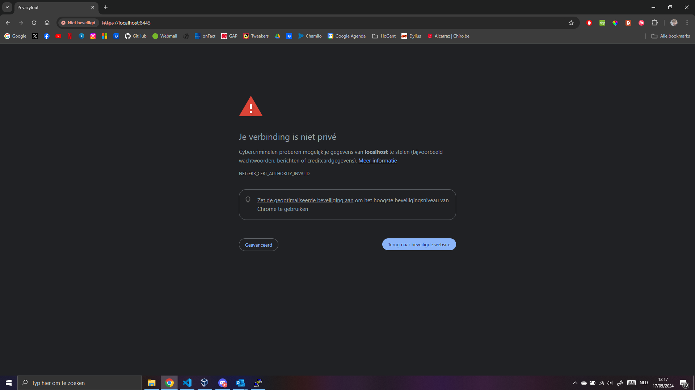
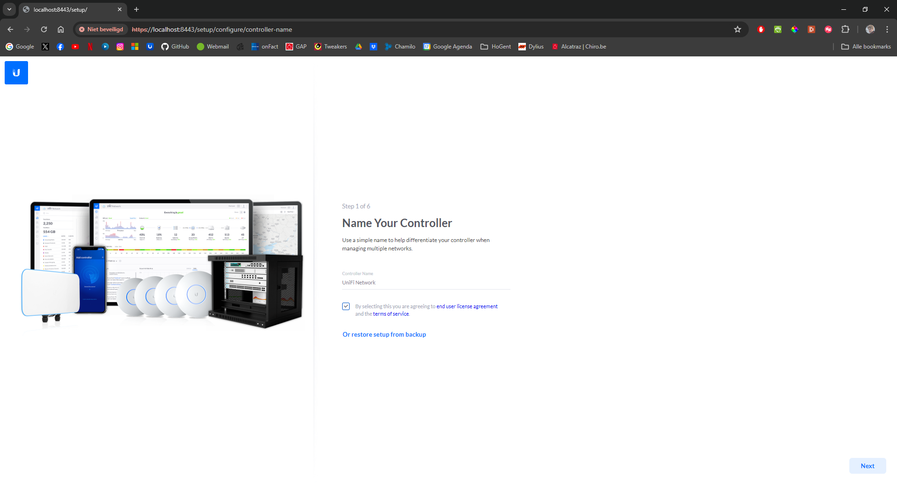
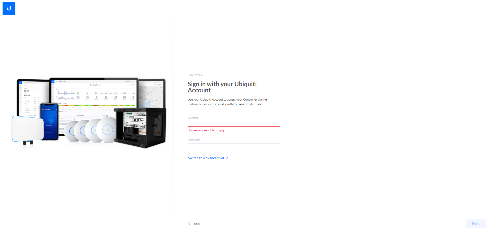
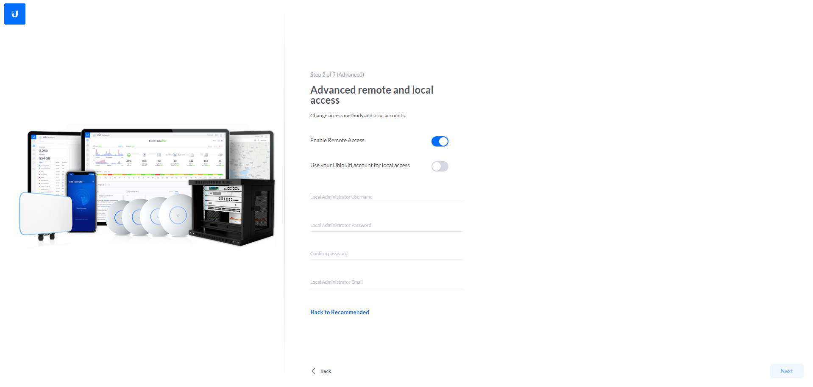
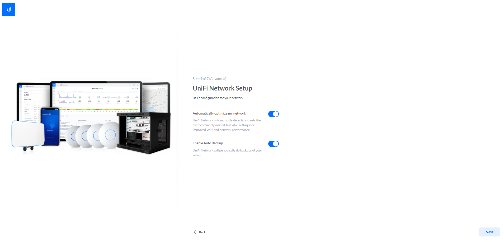
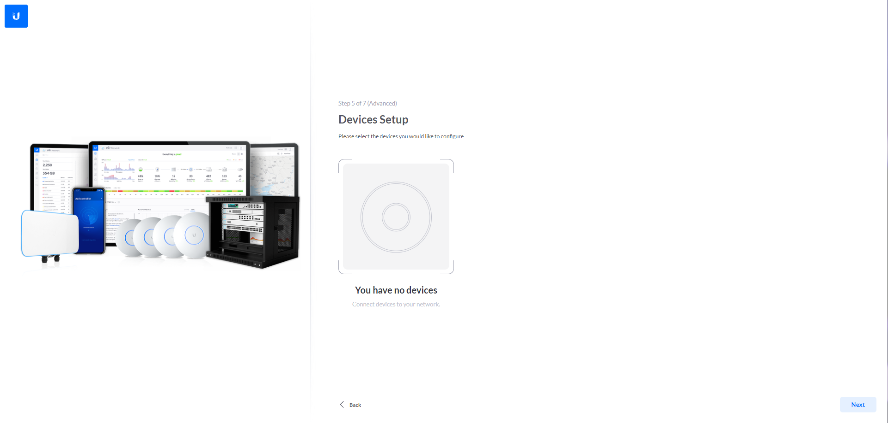
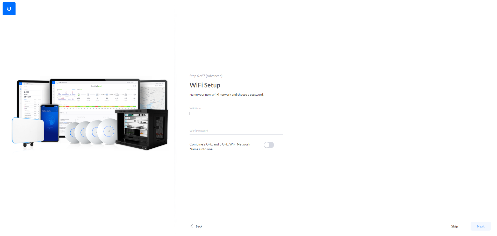
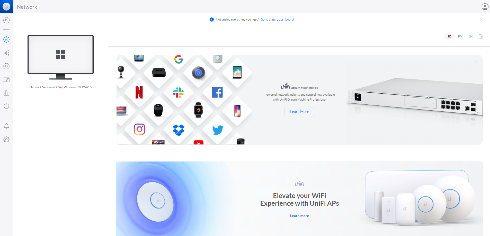

# Unifi configuratie manual

1. Ga in een webbrowser naar [https://localhost:8443](https://localhost:8443). Uw krijgt een foutmelding aangezien er geen certificaten voor de https verbinding aangemaakt zijn. Klik op **Geavanceerd** en daarna op **Doorgaan naar localhost**

2. Op het volgende scherm kunt u de controller een naam geven. Wij gaan verder met de standaard *UniFi Network*. Onder de naam moet ook de EULA geaccepteerd worden door het selectievakje aan te klikken. Daarna klikt u op **Next** in de rechter onderhoek.

3. Er wordt gevraagd om in te loggen met een ubiquiti account. Ofwel logt u in en gaat verder naar stap 6 ofwel klikt u op **Switch to Advanced Setup**

4. Zet de knop naast **Enable Remote Access** uit. Zet ook de knop naast **Use your Ubiquiti account for local access** uit. Daarna kan u een lokale account aanmaken door een gebruikersnaam, wachtwoord en email in te vullen. Klik daarna op **Next**

5. Klik rechtsonder op **Next**

6. Aangezien we geen fysieke apparaten toevoegen aan het Unifi netwerk, klik op **Next** rechtsonder.

7. We hoeven voor deze demo ook geen WiFi netwerk te configureren. Klik daarom op **Skip** rechtsonder.

8. Eventueel kan op deze pagina het land en de tijdzone aangepast worden. Klik daarna op **Finish**

